# Harbor

[](https://github.com/tpgiv1995/harbor/actions/workflows/ci.yml)

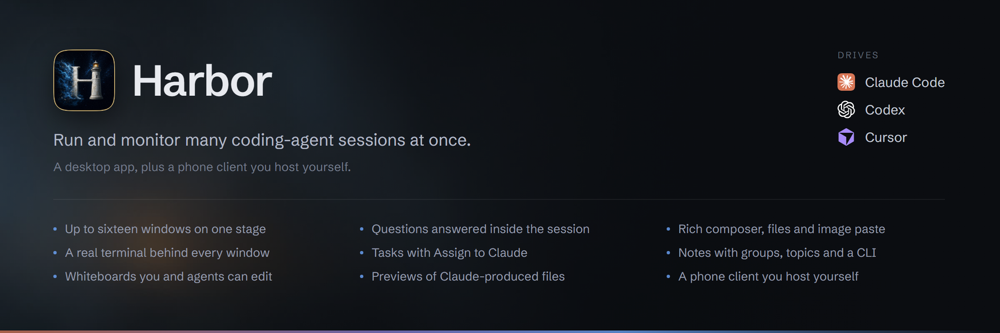

Harbor runs and monitors **Claude Code**, **OpenAI Codex** and **Cursor** CLI
sessions side by side. Open a session from the project rail to read its live
transcript in a conversation window. The stage holds up to sixteen windows;
one command bar drives the selected session. Each window also has a `>_`
toggle for its real terminal.

Harbor can read sessions started outside the app. Sending to one adopts or
resumes it through Harbor's session daemon.

## What it does

- **Questions answered in the session.** With Harbor's Claude hook installed,
  `AskUserQuestion` becomes a form with options, multiple selections, notes,
  free text and one Submit. Sessions without the hook use the terminal answer
  card for supported prompts and a fallback panel for unclassified blockers.
- **A rich composer.** Write lists, nested lists, links and quotes; Harbor
  sends markdown. Drop files as chips, paste images, and preview attachments.
  Dictation and live voice are optional and use your own OpenAI key.
- **Tasks, Notes and Board.** Organize tasks and subtasks, hand a task to a new
  session with **Assign to Claude**, keep notes in groups with topics, or draw
  a whiteboard. The `harbor-tasks`, `harbor-notes` and `harbor-board` CLIs let
  agents work with the same documents when you ask.
- **Provider and account controls.** Choose a provider, account, model and
  reasoning effort at launch. Live session controls include permission mode,
  plugins and slash commands where supported. Claude model discovery supplements
  bundled defaults; Codex models and reasoning levels come from the configured
  CLI home's model cache, with fallback choices when it is unavailable.
- **Files rendered inside Harbor.** Preview HTML, images, PDFs and video, with
  search, filters, sorting and project grouping. Discovery currently reads
  **Claude Code transcripts only**; Codex and Cursor outputs are not indexed.
- **A phone client you host yourself.** Read and send to provider sessions,
  manage Tasks and edit Notes over loopback or your own tailnet. Phone Notes
  does not yet show desktop groups.

The rail supports search, date and project filters, sorting and folding. It
combines several Claude accounts and shows their usage/reset times. The title
bar includes a system memory/commit meter and provider CLI update notices.
Session workflow strips open phase inspectors when run records exist. On
Windows, the taskbar badge draws attention to open sessions needing a response
or with an unseen completion.

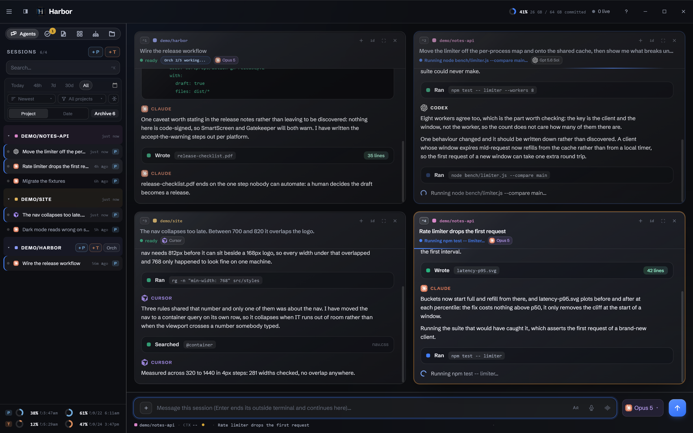

<sub><b>One stage, three providers.</b> Four conversation windows share the current six-view rail. The selected window receives the command bar's draft. The orchestration chip describes the fixture project's queue; it is separate from a session's workflow strip.</sub>

<table>
<tr>
<td width="50%"><a href="docs/screenshots/grid.png">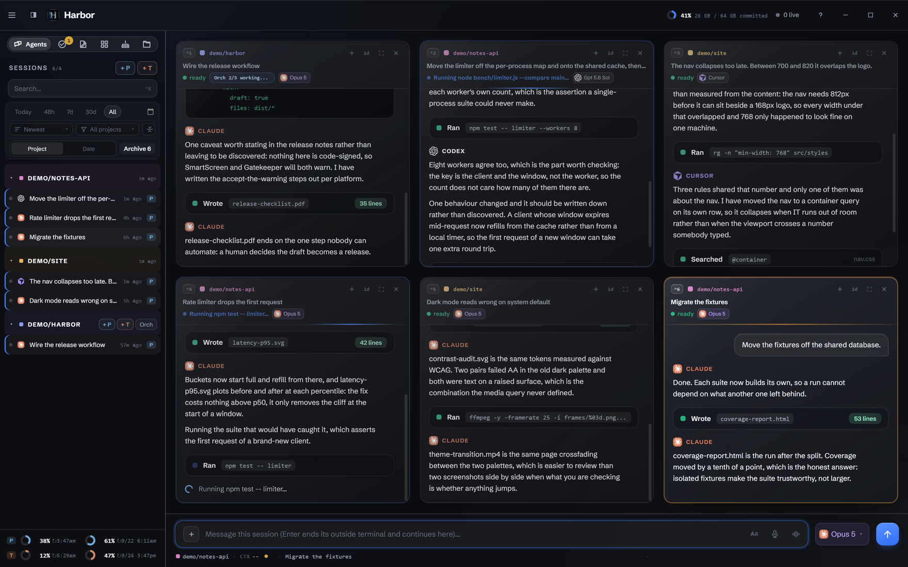</a><br><sub><b>The adaptive grid.</b> One window fills the stage, two split it, and more use equal cells. Drag headers to reorder, or focus one window within the stage.</sub></td>
<td width="50%"><a href="docs/screenshots/questions.png">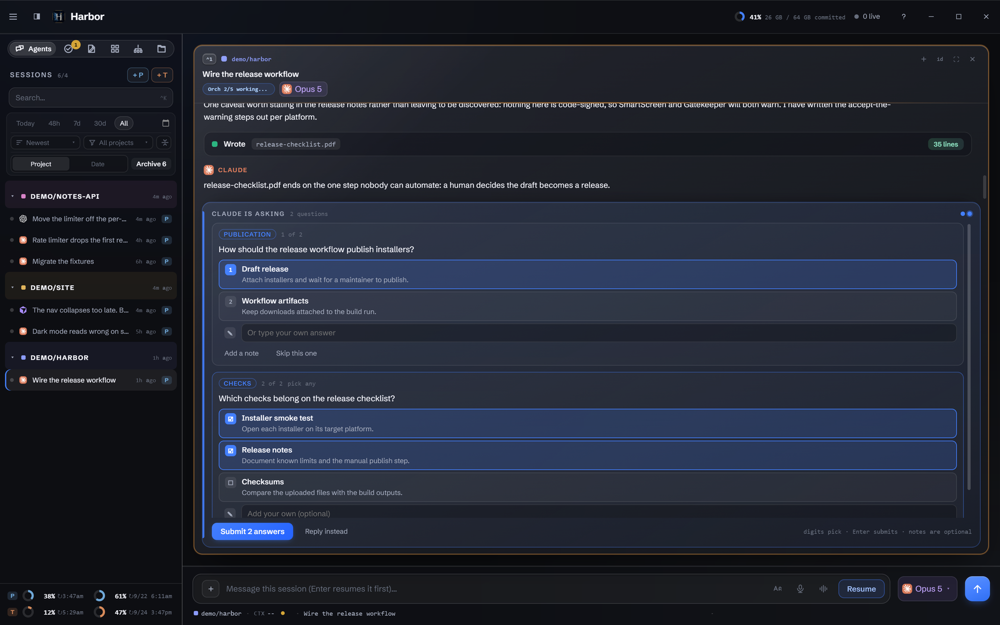</a><br><sub><b>Answer in place.</b> The hook supplies the question data. Choose answers, add a note or reply in your own words, then submit the batch.</sub></td>
</tr>
<tr>
<td width="50%"><a href="docs/screenshots/composer.png">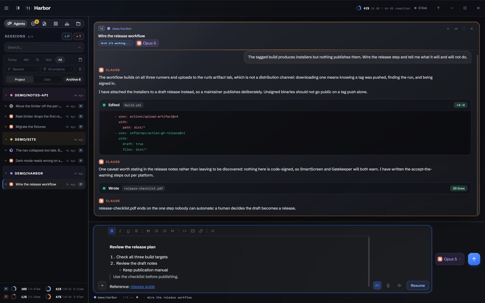</a><br><sub><b>Compose a useful brief.</b> Lists, quotes and links remain readable while you write and serialize to markdown when sent.</sub></td>
<td width="50%"><a href="docs/screenshots/session-config.png">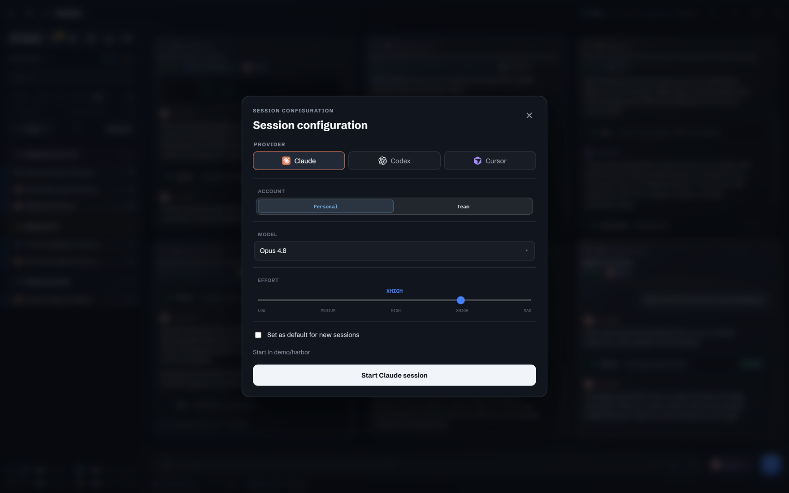</a><br><sub><b>Starting a session.</b> Pick the provider, account, model and effort. Available options depend on the configured CLI and account; the live configuration form adds session-specific controls.</sub></td>
</tr>
<tr>
<td width="50%"><a href="docs/screenshots/tasks.png">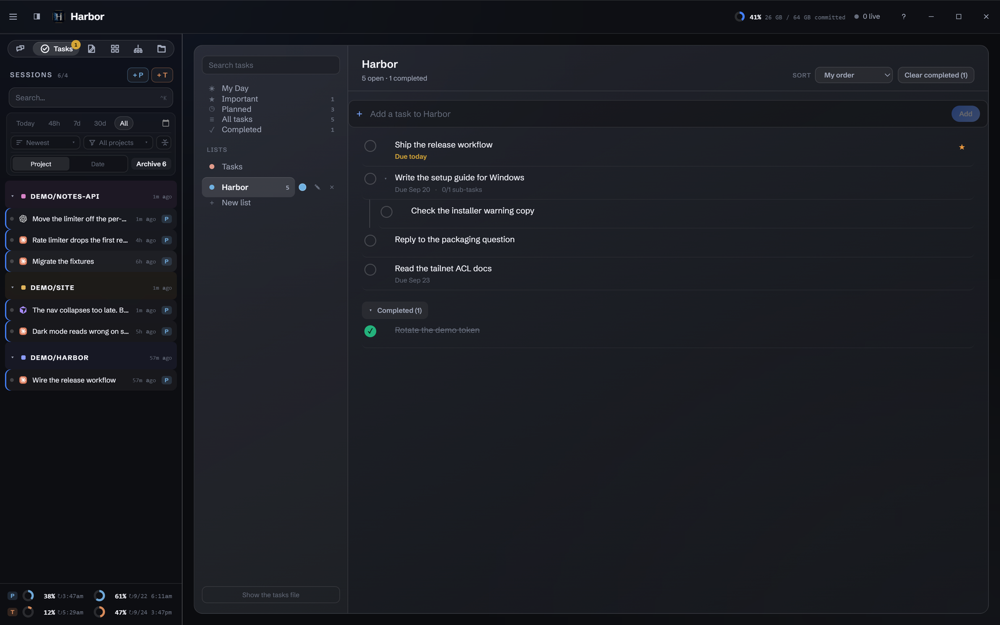</a><br><sub><b>Tasks.</b> Keep lists, due dates and subtasks. Assign to Claude starts work in a project folder and permission mode you choose.</sub></td>
<td width="50%"><a href="docs/screenshots/notes.png">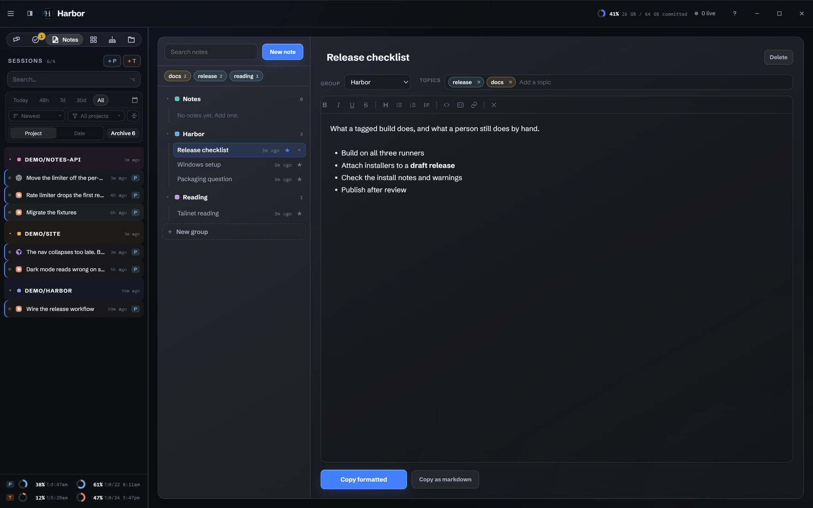</a><br><sub><b>Notes.</b> Groups, topics, pins and search organize the scratchpad. Copy the finished note as formatted text or markdown.</sub></td>
</tr>
<tr>
<td width="50%"><a href="docs/screenshots/whiteboard.png">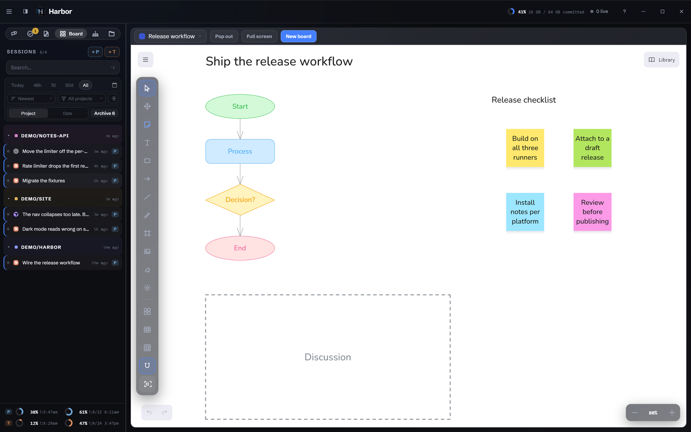</a><br><sub><b>Board.</b> Shapes, stickies, connectors, frames and templates on an Excalidraw canvas. This synthetic scene was written through Harbor's board store and CLI.</sub></td>
<td width="50%"><a href="docs/screenshots/files.png">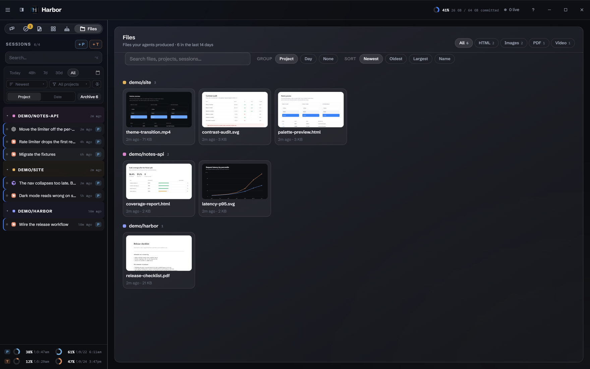</a><br><sub><b>Files.</b> Outputs named in recent Claude Code transcripts, previewed inside Harbor. Codex and Cursor discovery remains a known gap.</sub></td>
</tr>
<tr>
<td width="50%"><a href="docs/screenshots/orch.png">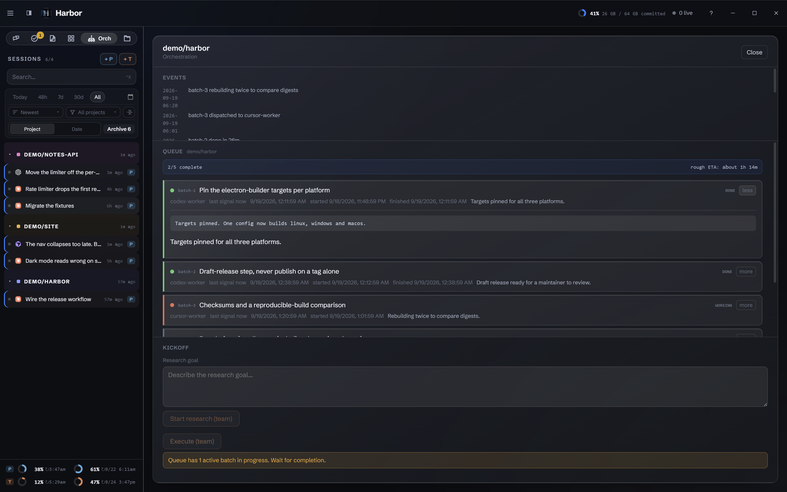</a><br><sub><b>Optional orchestration.</b> Inspect batches, workers and events. Kickoff needs a companion delegation CLI that this repository does not ship; the wizard disables the view when it finds none.</sub></td>
<td width="50%"><a href="docs/screenshots/mobile.png">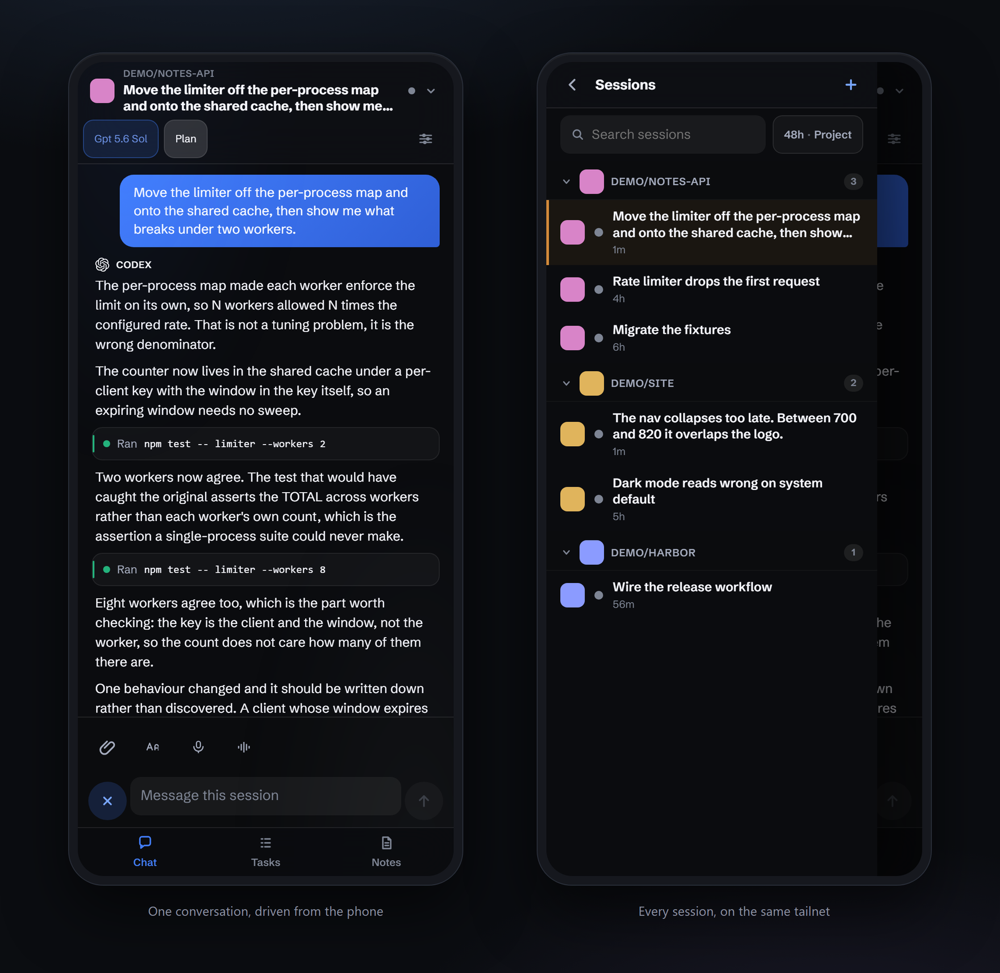</a><br><sub><b>The phone client.</b> An installable web app served beside your sessions, with Chat, Tasks and Notes. The two screens use the same synthetic corpus as the desktop.</sub></td>
</tr>
</table>

All published screenshots use the synthetic demo corpus. Capture instructions
and hidden-window rules are in [the visual guide](docs/VISUALS.md).

## Requirements

- **Node.js 22.12.0 or newer.** Earlier Node 22 releases do not meet the Vite
  build requirement. Development and CI currently use Node 24.
- **An installed, signed-in coding-agent CLI.** Configure the providers you use
  in setup. The standard path uses Claude Code; Codex and Cursor are optional.
- Harbor's own session daemon, `sessiond`, ships in this repository. It needs
  no separate backend installation.

| Platform | Status |
| --- | --- |
| Windows | Primary development platform. CI runs the unit gate on `windows-latest` for every push; the badge at the top of this page is its current state. |
| Linux | Original development platform. The old desktop E2E harness remains Linux-specific and is not a current release gate. |
| macOS | Not validated on a Mac. [The macOS guide](setup/macos/README.md) is a validation checklist, not a support claim. |

Electron 37 remains a deferred upgrade outside the currently supported majors.
See [the backlog](docs/BACKLOG.md) for limits and follow-up work.

## Install

### Download a build

A `v*` tag builds native installers and attaches them to a **draft** release.
A maintainer must publish that draft. Check [the releases page](https://github.com/tpgiv1995/harbor/releases);
if no published build is available, use the source instructions below.
Manual workflow dispatch uploads build artifacts without publishing a release.

The installers are unsigned. Windows SmartScreen and macOS Gatekeeper may warn.
Review the source and release provenance before deciding to run an unsigned
build. [Packaging notes](docs/PACKAGING.md) describe the targets and limits.

### Build from source

PowerShell, replacing `C:\src\harbor` with your checkout:

```powershell
Set-Location 'C:\src\harbor\app'
npm ci
npm run build
npm start
```

Bash alternative:

```bash
cd /path/to/harbor/app
npm ci
npm run build
npm start
```

The install hook also installs the daemon's own dependencies. On Windows the
desktop launches the daemon with Electron in Node mode; on POSIX it uses system
Node. Those dependencies live in the daemon package in both cases.

`npm start` loads the built renderer. `npm run dev` starts Vite and Electron
for development without a prior renderer build. The app is single-instance;
a second normal launch activates the existing instance. See the
[platform setup guides](setup/README.md).

## The six views

- **Agents:** the conversation stage, terminal toggles, answer forms and composer.
- **Tasks:** lists, subtasks, due dates and Assign to Claude.
- **Notes:** a formatted scratchpad with groups, topics, pins and copy controls.
- **Board:** saved whiteboards with drawing tools, templates and board management.
- **Orch:** project queues and kickoff controls, shown only when enabled. It
  requires an external companion; see [Commands](docs/COMMANDS.md).
- **Files:** previews of outputs discovered in recent Claude Code transcripts.

The chosen view persists across restarts. Agents can use the Tasks, Notes and
Board CLIs on request; those CLIs read and write the same stores as the app.

## The phone client

Build with `npm run build:web` and start its headless server with
`npm run start:server`, from the same checkout's `app` directory. The server
must run on the machine that owns the sessions and code. Add the page to the
phone's home screen; there is no app-store download.

The client is intended for loopback or your own tailnet and uses a bearer token.
Follow [mobile setup](setup/mobile.md) and read the existing
[mobile access documentation](docs/SECURITY-MOBILE.md) before exposing it.
Phone Notes edits the shared document but does not yet present desktop groups.

## Configuration and setup

The seven-step wizard covers the platform, Claude accounts, other providers,
commands, optional shared config, optional orchestration and launch defaults.
It combines detected installations with editable settings and conventional
defaults. Finish writes the config and requests an app restart.

On Windows the normal config is `%USERPROFILE%\.harbor\config.json`, separate
from Electron's `%APPDATA%` user-data directory. Linux uses
`~/.config/harbor/config.json`; macOS uses
`~/Library/Application Support/harbor/config.json`. `HARBOR_CONFIG_FILE` can
override it. The app menu's setup item reopens the wizard without deleting data.

[Configuration](docs/CONFIGURATION.md) lists the stores, overrides, provider
binary precedence, voice key path and signed-in CLI session titling.

## Architecture

Electron main owns processes and providers, preload exposes the `window.harbor`
bridge, and React renders the rail, stage and views. Shared modules carry the
document and transcript logic used across desktop, server and tests.

Conversations come from provider transcripts. Terminal I/O and sends go through
the sole supported backend, `sessiond`. Its keeper processes own session PTYs
separately from the GUI, so an ordinary GUI restart does not end the sessions.
`bin/harbor-sessiond` supplies lifecycle commands, including status, handover
and recovery. [The handbook](docs/HANDBOOK.md) explains the subsystem contracts.

## Testing

PowerShell, from an isolated checkout:

```powershell
Set-Location 'C:\src\harbor\app'
npm run build
npm test -- --exclude daemon --exclude bin
```

This matches the unit families selected by CI. It is not an Electron UI,
installer or real-provider conversation test. `npm test` also includes the
separate daemon and CLI integration families, which need their own prerequisites.

The mobile wrapper uses headless Chromium on Windows. The wizard wrapper has a
hidden Windows lane. The old `test:e2e` and `test:e2e:sessiond` commands retain
Linux display tooling and are not a Windows gate. Existing `drive-*-win` scripts
have different isolation assumptions; inspect each before running one on a live
workstation. [Contributing](CONTRIBUTING.md) gives the safe workflow.

## Troubleshooting

Start with [AGENTS.md](AGENTS.md), the installation and configuration reference.

For a read-only daemon status check in PowerShell:

```powershell
Set-Location 'C:\src\harbor'
$env:ELECTRON_RUN_AS_NODE = '1'
& '.\app\node_modules\electron\dist\electron.exe' '.\bin\harbor-sessiond' status
Remove-Item Env:ELECTRON_RUN_AS_NODE
```

Bash alternative, using system Node:

```bash
cd /path/to/harbor
node bin/harbor-sessiond status
```

For a blank window, a diagnostic launch with software graphics can help:

```powershell
Set-Location 'C:\src\harbor\app'
npm start -- --disable-gpu
```

Reopen setup from the app menu. Do not delete `config.json` to force setup:
existing install markers can trigger migration and skip it. The configuration
guide includes a backup-and-reset procedure if the menu cannot be reached.

Harbor reads provider transcripts for display. Explicit rail deletion moves
selected transcripts to trash, and optional shared-config setup can replace
selected directories with backed-up links. Those are user-requested mutations,
so the transcript stores are not described as universally read-only.

## Contributing and licensing

See [Contributing](CONTRIBUTING.md), [release notes](CHANGELOG.md),
[the backlog](docs/BACKLOG.md) and [reporting a security concern](SECURITY.md).
AI tools helped write this project; maintainers are responsible for reviewing
and verifying contributions.

Harbor's code is MIT licensed. See [LICENSE](LICENSE), [NOTICE](NOTICE) and
[third-party material](docs/THIRD-PARTY.md). The Claude SVG's exact provenance
remains unresolved and is recorded there.
